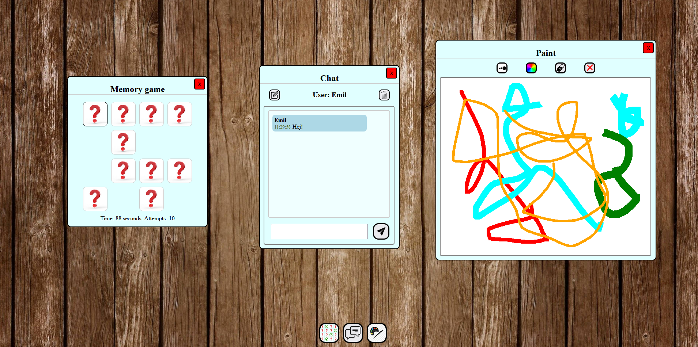

# PWD - Personal Web Desktop

A personal web desktop with a memory game, a chat window and paint. All of which can be dragged, multiple windows opened and ran simultanously.
- Memory game comes in three different grid sizes (4x4, 2x4, 2x2).
- Chat window uses an API to chat with other windows using this message app API.
- Paint is basically paint, just a simpler version. 

Firstly, make sure you have Git and npm properly installed. Start by cloning this repo. Once the repository is cloned, locate Git Bash (or similar) into the cloned folder. Enter "npm install" to install the npm package manager. This will also install the Javascript Builder. 

To run:
- Make sure you have git and npm installed.
- Clone the repo.
- Run "npm install".
- Run "npm start".
- The application is available at localhost:4173.

